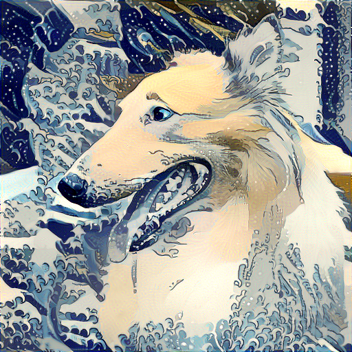
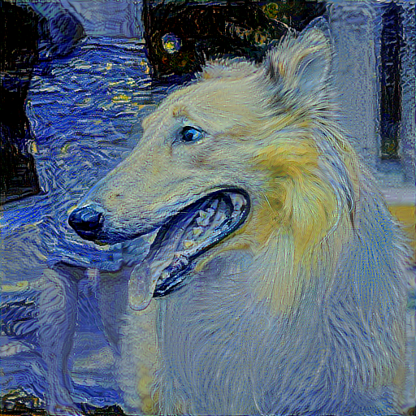
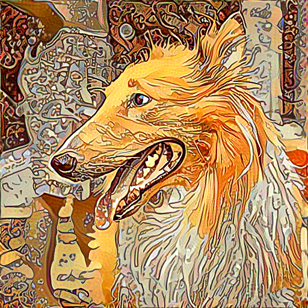
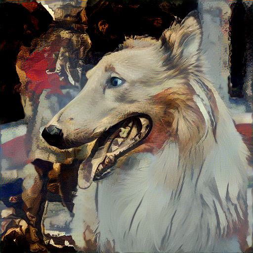
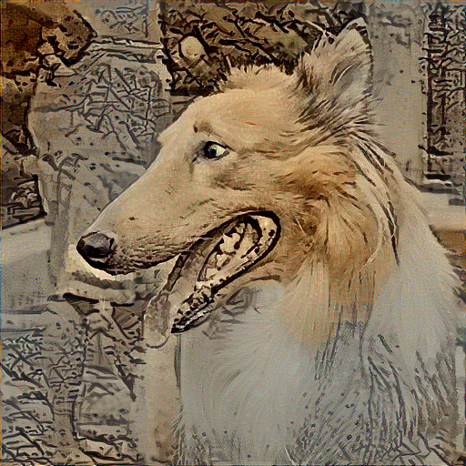
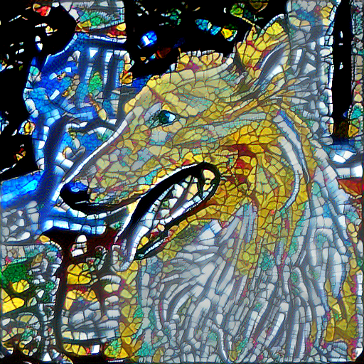

# アートスタイル変更サンプル
画像大きい

使用画像

[dog , Jeff Ro , Flickr](https://www.flickr.com/photos/rapfish/6312937936/in/photolist-aBRsvw-pPFG4j-RUuNvS-keFshf-dAsmE-pzme9k-YhuC49-FAAAud-9aRtNF-nHhJyz-9YpP1Q-RJx4tj-eZnrWK-QJ8Z8F-89PL6y-2tCh6-9a1Na-hvv58J-QJ8u2p-QJ8gPP-SGNezP-4aAHoV-3s48b1-9YmU7z-bkPbyj-eZnrMP-star-VD7wmz-7MoarF-9JYTEB-bpvSmo-7JFNNF-RQZeV4-5iC2WD-4RcxxF-rnYKbg-dUwxVB-5Bxd34-RUuyYS-9BtV9r-bnmdWh-6ee8p2-R9jnDW-6sBnu5-f5fGu5-4j5WdL-2pdVqB-4WYuxK-bGTHQe-6za3es) [(CC BY-SA 2.0)](https://creativecommons.org/licenses/by-sa/2.0/)

## 葛飾北斎 神奈川沖浪裏風

## ゴッホ 星夜月風

## ミュシャ 黄道12宮風

## ドラクロワ 民衆を導く自由の女神風

## 雪舟 秋冬山水図風

## ストラスブール大聖堂 バラ窓(ステンドグラス)風

